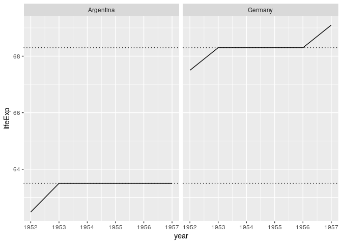

Bicycle
================

## Create a presentation

  - Render this document with “Knit” – as usual.
  - Change the output to `ioslides_presentation` and knit again.

## Packages

``` r
library(tidyverse)
#> ── Attaching packages ─────────────────── tidyverse 1.3.0 ──
#> ✓ ggplot2 3.3.2     ✓ purrr   0.3.4
#> ✓ tibble  3.0.3     ✓ dplyr   1.0.2
#> ✓ tidyr   1.1.1     ✓ stringr 1.4.0
#> ✓ readr   1.3.1     ✓ forcats 0.5.0
#> ── Conflicts ────────────────────── tidyverse_conflicts() ──
#> x dplyr::filter() masks stats::filter()
#> x dplyr::lag()    masks stats::lag()
library(here)
#> here() starts at /home/mauro/git/tidy-ds
library(fs)
library(vroom)
```

## Definition of tidy data


## From messy to tidy


## Import

Import all datasets in “data/by-continent” into a single data frame:
`messy`.

``` r
paths <- dir_ls(here("data", "by-continent"))
messy <- vroom(paths)
messy
#> # A tibble: 142 x 38
#>    continent country gdpPercap_1952 gdpPercap_1957 gdpPercap_1962 gdpPercap_1967
#>    <chr>     <chr>            <dbl>          <dbl>          <dbl>          <dbl>
#>  1 Africa    Algeria          2449.          3014.          2551.          3247.
#>  2 Africa    Angola           3521.          3828.          4269.          5523.
#>  3 Africa    Benin            1063.           960.           949.          1036.
#>  4 Africa    Botswa…           851.           918.           984.          1215.
#>  5 Africa    Burkin…           543.           617.           723.           795.
#>  6 Africa    Burundi           339.           380.           355.           413.
#>  7 Africa    Camero…          1173.          1313.          1400.          1508.
#>  8 Africa    Centra…          1071.          1191.          1193.          1136.
#>  9 Africa    Chad             1179.          1308.          1390.          1197.
#> 10 Africa    Comoros          1103.          1211.          1407.          1876.
#> # … with 132 more rows, and 32 more variables: gdpPercap_1972 <dbl>,
#> #   gdpPercap_1977 <dbl>, gdpPercap_1982 <dbl>, gdpPercap_1987 <dbl>,
#> #   gdpPercap_1992 <dbl>, gdpPercap_1997 <dbl>, gdpPercap_2002 <dbl>,
#> #   gdpPercap_2007 <dbl>, lifeExp_1952 <dbl>, lifeExp_1957 <dbl>,
#> #   lifeExp_1962 <dbl>, lifeExp_1967 <dbl>, lifeExp_1972 <dbl>,
#> #   lifeExp_1977 <dbl>, lifeExp_1982 <dbl>, lifeExp_1987 <dbl>,
#> #   lifeExp_1992 <dbl>, lifeExp_1997 <dbl>, lifeExp_2002 <dbl>,
#> #   lifeExp_2007 <dbl>, pop_1952 <dbl>, pop_1957 <dbl>, pop_1962 <dbl>,
#> #   pop_1967 <dbl>, pop_1972 <dbl>, pop_1977 <dbl>, pop_1982 <dbl>,
#> #   pop_1987 <dbl>, pop_1992 <dbl>, pop_1997 <dbl>, pop_2002 <dbl>,
#> #   pop_2007 <dbl>
```

## Tidy with `pivot_longer()`: Task

  - Use `where(is.numeric)` inside `pivot_longer()` to pivot over
    numeric columns.
  - Use the argument `names_to"` to create the new column “metric”.

<!-- end list -->

``` r
longer <- messy %>% 
  ____________(where(__________), ________ = "metric")

longer
```

## Tidy with `pivot_longer()`: Result

    #> # A tibble: 5,112 x 4
    #>    continent country metric         value
    #>    <chr>     <chr>   <chr>          <dbl>
    #>  1 Africa    Algeria gdpPercap_1952 2449.
    #>  2 Africa    Algeria gdpPercap_1957 3014.
    #>  3 Africa    Algeria gdpPercap_1962 2551.
    #>  4 Africa    Algeria gdpPercap_1967 3247.
    #>  5 Africa    Algeria gdpPercap_1972 4183.
    #>  6 Africa    Algeria gdpPercap_1977 4910.
    #>  7 Africa    Algeria gdpPercap_1982 5745.
    #>  8 Africa    Algeria gdpPercap_1987 5681.
    #>  9 Africa    Algeria gdpPercap_1992 5023.
    #> 10 Africa    Algeria gdpPercap_1997 4797.
    #> # … with 5,102 more rows

## `separate()`: Task

  - `metric` is still messy; `separate()` `metric` into `c("metric",
    "year")`.

<!-- end list -->

``` r
tidy <- longer %>% ________(______, c("metric", "____"))
tidy
```

## `separate()`: Result

    #> # A tibble: 5,112 x 5
    #>    continent country metric    year  value
    #>    <chr>     <chr>   <chr>     <chr> <dbl>
    #>  1 Africa    Algeria gdpPercap 1952  2449.
    #>  2 Africa    Algeria gdpPercap 1957  3014.
    #>  3 Africa    Algeria gdpPercap 1962  2551.
    #>  4 Africa    Algeria gdpPercap 1967  3247.
    #>  5 Africa    Algeria gdpPercap 1972  4183.
    #>  6 Africa    Algeria gdpPercap 1977  4910.
    #>  7 Africa    Algeria gdpPercap 1982  5745.
    #>  8 Africa    Algeria gdpPercap 1987  5681.
    #>  9 Africa    Algeria gdpPercap 1992  5023.
    #> 10 Africa    Algeria gdpPercap 1997  4797.
    #> # … with 5,102 more rows

## `unite()` and `pivot_wider()`: Task

Revert what you did before: go back to a messy dataset:

  - Use `unite()` to unite the columns `metric` and `year` as “metric”.
  - Use `pivot_wider()` to take the `names_from` the column `metric` and
    create new columns, taking `values_from` the column `value`.

<!-- end list -->

``` r
tidy %>% 
  _____("metric", ______, year) %>% 
  ___________(names_from = ______, values_from = _____)
```

## `unite()` and `pivot_wider()`: Result

    #> # A tibble: 142 x 38
    #>    continent country gdpPercap_1952 gdpPercap_1957 gdpPercap_1962 gdpPercap_1967
    #>    <chr>     <chr>            <dbl>          <dbl>          <dbl>          <dbl>
    #>  1 Africa    Algeria          2449.          3014.          2551.          3247.
    #>  2 Africa    Angola           3521.          3828.          4269.          5523.
    #>  3 Africa    Benin            1063.           960.           949.          1036.
    #>  4 Africa    Botswa…           851.           918.           984.          1215.
    #>  5 Africa    Burkin…           543.           617.           723.           795.
    #>  6 Africa    Burundi           339.           380.           355.           413.
    #>  7 Africa    Camero…          1173.          1313.          1400.          1508.
    #>  8 Africa    Centra…          1071.          1191.          1193.          1136.
    #>  9 Africa    Chad             1179.          1308.          1390.          1197.
    #> 10 Africa    Comoros          1103.          1211.          1407.          1876.
    #> # … with 132 more rows, and 32 more variables: gdpPercap_1972 <dbl>,
    #> #   gdpPercap_1977 <dbl>, gdpPercap_1982 <dbl>, gdpPercap_1987 <dbl>,
    #> #   gdpPercap_1992 <dbl>, gdpPercap_1997 <dbl>, gdpPercap_2002 <dbl>,
    #> #   gdpPercap_2007 <dbl>, lifeExp_1952 <dbl>, lifeExp_1957 <dbl>,
    #> #   lifeExp_1962 <dbl>, lifeExp_1967 <dbl>, lifeExp_1972 <dbl>,
    #> #   lifeExp_1977 <dbl>, lifeExp_1982 <dbl>, lifeExp_1987 <dbl>,
    #> #   lifeExp_1992 <dbl>, lifeExp_1997 <dbl>, lifeExp_2002 <dbl>,
    #> #   lifeExp_2007 <dbl>, pop_1952 <dbl>, pop_1957 <dbl>, pop_1962 <dbl>,
    #> #   pop_1967 <dbl>, pop_1972 <dbl>, pop_1977 <dbl>, pop_1982 <dbl>,
    #> #   pop_1987 <dbl>, pop_1992 <dbl>, pop_1997 <dbl>, pop_2002 <dbl>,
    #> #   pop_2007 <dbl>

## Create a small dataset: Review

Let’s create a small dataset to play with. You should understand this
code:

  - Remove `continent`.
  - Subset life expectancy values for Argentina and Germany before 1962.
  - Widen the dataset adding new columns with `names_from` the column
    `metric`.

## Create a small dataset: Review

``` r
subset1 <- tidy %>% 
  select(-continent) %>% 
  filter(
    country %in% c("Argentina", "Germany"), 
    metric == "lifeExp",
    year < 1962
  ) %>% 
  pivot_wider(names_from = metric)

subset1
#> # A tibble: 4 x 3
#>   country   year  lifeExp
#>   <chr>     <chr>   <dbl>
#> 1 Argentina 1952     62.5
#> 2 Argentina 1957     64.4
#> 3 Germany   1952     67.5
#> 4 Germany   1957     69.1
```

## Create a small dataset: Task

Now add a new column `mean`, holding the mean `lifeExp` for each
`country`:

  - Use `group_by()`.
  - Use `mutate()` to calculate mean `lifeExp` and to make `year`
    numeric.
  - `ungroup()`.

<!-- end list -->

``` r
subset2 <- subset1 %>% 
  ________(country) %>% 
  ______(mean = ____(lifeExp), year = as.numeric(____)) %>% 
  _______()

subset2
```

## Create a small dataset: Result

    #> # A tibble: 4 x 4
    #>   country    year lifeExp  mean
    #>   <chr>     <dbl>   <dbl> <dbl>
    #> 1 Argentina  1952    62.5  63.4
    #> 2 Argentina  1957    64.4  63.4
    #> 3 Germany    1952    67.5  68.3
    #> 4 Germany    1957    69.1  68.3

## Create a small dataset: Tweak

Let’s degrade this dataset for a later example.

``` r
arg_ger <- subset2 %>% slice(-2) %>% select(-mean)
```

## `complete()`: What’s missing?

Say you have the dataset `arg_ger`; it is missing data in between 1952
and 1957, but you know the historical mean for each country. Let’s fill
the missing data.

``` r
arg_ger
#> # A tibble: 3 x 3
#>   country    year lifeExp
#>   <chr>     <dbl>   <dbl>
#> 1 Argentina  1952    62.5
#> 2 Germany    1952    67.5
#> 3 Germany    1957    69.1

# Historical mean (1952-2007) of life expectancy
mean_argentina <- 63.5
mean_germany <- 68.3
```

## `complete()`: Task

  - Make the implicit missing data explicit with `complete()`.

<!-- end list -->

``` r
arg_ger %>% ________(_______, year)
```

## `complete()`: Result

    #> # A tibble: 4 x 3
    #>   country    year lifeExp
    #>   <chr>     <dbl>   <dbl>
    #> 1 Argentina  1952    62.5
    #> 2 Argentina  1957    NA  
    #> 3 Germany    1952    67.5
    #> 4 Germany    1957    69.1

## `fill`: Task

  - Now fill the missing values of `lifeExp` with the value in
    `mean_argentina`.

<!-- end list -->

``` r
filled <- arg_ger %>% 
  complete(country, year, fill = list(lifeExp = ______________))

filled
```

## `fill`: Result

    #> # A tibble: 4 x 3
    #>   country    year lifeExp
    #>   <chr>     <dbl>   <dbl>
    #> 1 Argentina  1952    62.5
    #> 2 Argentina  1957    63.5
    #> 3 Germany    1952    67.5
    #> 4 Germany    1957    69.1

## `full_seq()`: Demo

Compare:

``` r
filled %>% pull(year)
#> [1] 1952 1957 1952 1957
filled %>% pull(year) %>% full_seq(period = 1)
#> [1] 1952 1953 1954 1955 1956 1957
```

## `full_seq()`: Task

  - Use `full_seq()` inside `complete()` to complete the full `year`
    sequence.

<!-- end list -->

``` r
full_mean <- filled %>% 
  complete(year = ________(year, period = 1), country = _______)

full_mean
```

## `full_seq()`: Result

    #> # A tibble: 12 x 3
    #>     year country   lifeExp
    #>    <dbl> <chr>       <dbl>
    #>  1  1952 Argentina    62.5
    #>  2  1952 Germany      67.5
    #>  3  1953 Argentina    NA  
    #>  4  1953 Germany      NA  
    #>  5  1954 Argentina    NA  
    #>  6  1954 Germany      NA  
    #>  7  1955 Argentina    NA  
    #>  8  1955 Germany      NA  
    #>  9  1956 Argentina    NA  
    #> 10  1956 Germany      NA  
    #> 11  1957 Argentina    63.5
    #> 12  1957 Germany      69.1

## `case_when()`: Task

Fill `lifeExp` with the historical mean values for each country:

  - Use `case_when()` inside `mutate()`.
  - The 3 possible results are `mean_argentina`, `mean_germany`, or
    `lifeExp`.

## `case_when()`: Task

``` r
full <- full_mean %>% 
  mutate(
    lifeExp = _________(
      _____(lifeExp) & country == "_________" ~ mean_argentina,
      is.na(_______) & _______ == "Germany"   ~ ____________,
      # Any other case
      TRUE                                    ~ lifeExp
    )
  )

full
```

## `case_when()`: Result

    #> # A tibble: 12 x 3
    #>     year country   lifeExp
    #>    <dbl> <chr>       <dbl>
    #>  1  1952 Argentina    62.5
    #>  2  1952 Germany      67.5
    #>  3  1953 Argentina    63.5
    #>  4  1953 Germany      68.3
    #>  5  1954 Argentina    63.5
    #>  6  1954 Germany      68.3
    #>  7  1955 Argentina    63.5
    #>  8  1955 Germany      68.3
    #>  9  1956 Argentina    63.5
    #> 10  1956 Germany      68.3
    #> 11  1957 Argentina    63.5
    #> 12  1957 Germany      69.1

## Plot: Task

  - Make a line-plot of `year` versus `lifeExp`.
  - Add a “dotted” line intercepting `y` at the historical mean of each
    country.
  - Use `facet_wrap()` to plot each country in a separate panel.

<!-- end list -->

``` r
full %>% 
  ggplot(aes(____, _______)) + 
  _____line() +
  _____hline(__________ = c(mean_argentina, mean_germany), linetype = "______") +
  __________(~country)
```

## Plot: Task

<!-- -->

# Takeaways

## Takeaways: Imoprt

  - Use `vroom()` to ready multiple files at once and into a single data
    frame.

## Takeaways: Tidy

  - The tidyverse prefers tidy data where:
      - Every variable is in its own column.
      - Every observation is in its own row.
  - Use `pivot_longer()` and `pivot_wider()` to move columns to values
    and back.
  - Use `unite()` to unite multiple ones into a single one.
  - Use `separate()` to separate one column into multiple ones.
  - Complete missing data with `complete()`, `full_seq()`, `fill`,
    `case_when()`.

## Takeaways: Transform

  - The select-helpers (e.g. `where()`) appear in many places in the
    tidyverse.
  - You can `filter()` with multiple conditions separated by `&` or
    comma `,`.

## Takeaways: Visualise

  - You can extend the basic plot template to include multiple layers.
  - Use `facet_wrap()` to plot subsets of data in separate panels.

## Takeaways: Communicate

  - You can change the output format to, e.g., create .html
    presentations.
